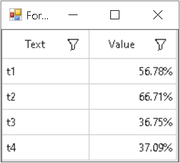

# How to Customize the Column Format in WinForms DataGrid?

This sample illustrates how to customize the column format in [WinForms DataGrid](https://www.syncfusion.com/winforms-ui-controls/datagrid) (SfDataGrid).

`DataGrid` allows you to create and assign custom format for the columns through the [IDataGridFormatProvider](https://help.syncfusion.com/cr/windowsforms/Syncfusion.WinForms.DataGrid.IDataGridFormatProvider.html) interface. The [GridColumnBase.FormatProvider](https://help.syncfusion.com/cr/windowsforms/Syncfusion.WinForms.DataGrid.GridColumnBase.html#Syncfusion_WinForms_DataGrid_GridColumnBase_FormatProvider) property can be used to set custom format for the columns.

#### C#
```c#
sfDataGrid1.Columns["Value"].Format = "00,00%";
sfDataGrid1.Columns["Value"].FormatProvider = new CustomFormatter();

public class CustomFormatter : IDataGridFormatProvider
{
    public object Format(string format, GridColumnBase gridColumn, object record, object value)
    {
        if (value == null)
        {
            throw new ArgumentNullException((value == null) ? "format" : "args");
        }

        if (gridColumn is GridColumn && (gridColumn as GridColumn).MappingName == "Value")
        {
            var orderInfo = record as OrderInfo;
                return (Convert.ToDecimal((orderInfo.Value.ToString()))).ToString("0.00%");
        }
        return value.ToString();
    }

    public object GetFormat(Type formatType)
    {
        return this;
    }

    public string Format(string format, object arg, IFormatProvider formatProvider)
    {
        throw new NotImplementedException();
    }
}
```



## Requirements to run the demo
 Visual Studio 2015 and above versions